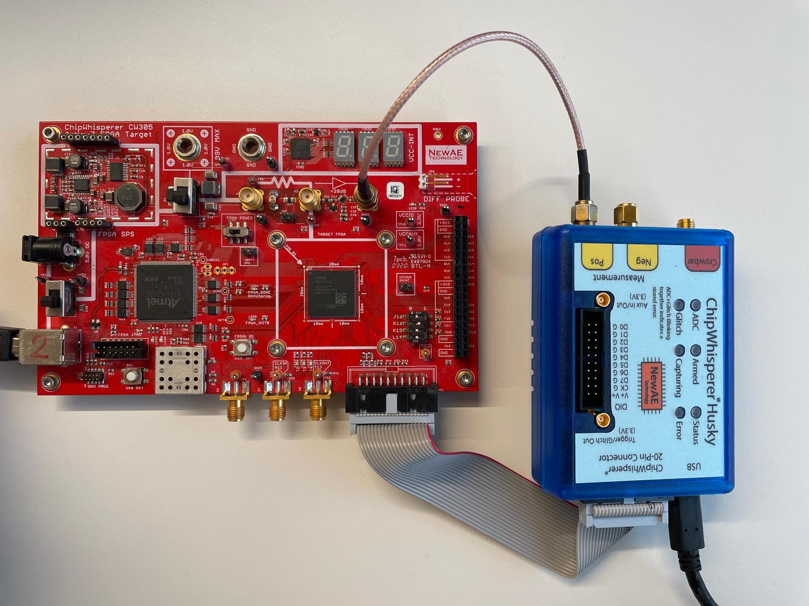

# Lightweight UOV Co-processor with Oil Space Blinding

This repository contains the open-source artifact of our paper [**Lightweight Hardware Accelerator for the UOV Signature Scheme with Oil Space Blinding**](https://eprint.iacr.org/2026/1451) accepted for IACR TCHES 2027, issue 1.
This work implements a lightweight hardware co-processor for the UOV post-quantum signature scheme. The work uses the second-round parameter sets and proposes optimization techniques for a low-memory yet performant accelerator. The accelerator supports UOV signing and verification, and includes a blinding side-channel countermeasure.

## Structure of the Artifact
The repository contains the following folders and important files:
- `runArtifact.sh`: Shell script executing the complete artifact. First, a Python virtual environment is created with the packages listed in `requirements.txt`. Then, the script generates the reference and input test vectors, runs Vitis HLS and Vivado, performs tests and trace collection on the FPGA, and renders a final artifact report.
- `uov_ref`: SageMath-based reference implementation of UOV. Generates the input and reference data for the HLS / RTL simulation and the FPGA tests. The correctness is verified against the official KAT files of the UOV team.
  - `kat`: A subset of known-answer test (KAT) files of the second-round UOV submission. See `uov_ref/kat/Readme.md` for details.
  - `data`: generated input and reference test vector data (created by `uov.py`)
- `hls`: Vitis HLS source code of the UOV co-processor
  - `uov.cpp`: contains the top level function of the co-processor
  - `uov_tb.cpp`: C++ testbench for the Vitis HLS C simulation and co-simulation
- `rtl`: RTL wrapper for the UOV HLS core
  - `uov_wrapper.sv`: wrapper connecting the HLS core to the block RAMs
  - `uov_wrapper_tb.sv`: SystemVerilog testbench checking signing and verification for all security levels against the reference data in `uov_ref/data`
  - `cw305`: RTL code for the ChipWhisperer CW305 SCA target board
  - `axi`: AXI4-Lite wrapper to use the co-processor as a Vitis RTL kernel
  - `vitis_hls_export`: contains RTL generated by Vitis HLS (filled by running Vitis HLS)
- `vitis`: Tcl scripts for Vitis and Vivado
  - `run_vitis_hls.tcl`: runs Vitis HLS: C simulation, C synthesis, and co-simulation. Exports the RTL IP to `rtl/vitis_hls_export`
  - `run_vivado_cw.tcl`: runs Vivado: performs behavioural simulation, synthesis and implementation, and writes output products (bitstream, utilization report, and timing report) to `results/`
- `cw`: Python host code to run the ChipWhisperer CW305 board
  - `mainCW305.py`: runs functional tests on the CW305 FPGA and performs the TVLA trace collection
- `results`: output products of the runs, such as log files, bitstream, reports, and traces
  - `makeReport.py`: collects the output products and compiles them into `results/report.pdf`
  - `uov_cw.bit`: pre-built reference bitstream. You can use this instead of running the full compilation flow. Note that a full run overwrites this file with the new build


## Requirements to Run the Artifact
### Hardware:
- A host machine with 32GB of RAM, 5GB of available disk space, a recent CPU, and internet connection
- ChipWhisperer CW305-A100 with Artix-7 100T FPGA Target ([website](https://rtfm.newae.com/Targets/CW305%20Artix%20FPGA/))
- ChipWhisperer-Husky ([website](https://chipwhisperer.readthedocs.io/en/latest/Capture/ChipWhisperer-Husky.html))
- USB and power measurement cables


### Software:
- Ubuntu version 26.04 or similar. We tested the setup on fresh Ubuntu 26.04 and Xubuntu 26.04 installations.
- Basic tools like `git`, `curl`, `unzip`, `libusb-1.0-0`, and `uv`. (Installation instructions are below)
- Optional: Full Vivado + Vitis + Vitis HLS 2022.2 installation ([Installation Guide](https://cloud.tugraz.at/index.php/s/k7SL46fbtCGM3zc)). Only required to reproduce the bitstream and implementation results. We also provide a ready-to-use bitstream for only running the TVLA.

## Setup
To prepare your setup, please follow the steps below:

**Step 1:** Install the required software if it is missing on your system:
```bash
sudo apt install git curl unzip libusb-1.0-0
curl -LsSf https://astral.sh/uv/install.sh | sh
```

**Step 2:** Clone this git repository:
```bash
git clone https://github.com/flokrieger/UOV-Coprocessor.git
```

**Step 3:** By default, accessing the USB devices (CW305 and Husky) requires root permission. To use them as a regular user, install NewAE's udev rules and add your user to the required groups (see the [ChipWhisperer Linux installation guide](https://chipwhisperer.readthedocs.io/en/latest/linux-install.html)). Do not connect the USB cables while executing this!
```bash
sudo curl -L -o /etc/udev/rules.d/50-newae.rules https://raw.githubusercontent.com/newaetech/chipwhisperer/develop/50-newae.rules
sudo groupadd -fr chipwhisperer
sudo udevadm control --reload-rules
sudo udevadm trigger
sudo usermod -aG chipwhisperer $USER
sudo usermod -aG plugdev $USER
```
Afterwards, log out and in again or reboot the host machine. To confirm that the group membership is active, run
```bash
id
```
The output must list both `chipwhisperer` and `plugdev`.

**Step 4:** If you do not have Vivado/VitisHLS version 2022.2 installed, please follow the instructions [here](https://cloud.tugraz.at/index.php/s/k7SL46fbtCGM3zc) to install the tools. This will take a while to download Vivado/VitisHLS. You can skip the Vivado/VitisHLS installation if you only want to run TVLA, as described in [Running only TVLA](#running-only-tvla).

Then, make sure Vivado and VitisHLS are in `$PATH`. If they are not, source the Vitis settings script (adapt the path to your installation). This also adds Vivado and VitisHLS to `$PATH`:
```bash
source /tools/Xilinx/Vitis/2022.2/settings64.sh
```
To verify, execute these commands:
```bash
vivado -version
vitis_hls -version
```
The output should look like this:
```
%> vivado -version
Vivado v2022.2 (64-bit)
SW Build 3671981 on Fri Oct 14 04:59:54 MDT 2022
IP Build 3669848 on Fri Oct 14 08:30:02 MDT 2022
Tool Version Limit: 2022.10
Copyright 1986-2022 Xilinx, Inc. All Rights Reserved.
%> vitis_hls -version                                                
Vitis HLS - High-Level Synthesis from C, C++ and OpenCL v2022.2 (64-bit)
SW Build 3670227 on Oct 13 2022
IP Build 3669848 on Fri Oct 14 08:30:02 MDT 2022
Tool Version Limit: 2019.12
Copyright 1986-2022 Xilinx, Inc. All Rights Reserved.
```

**Step 5:** Connect the CW305 target board with the Husky and the host machine as shown here:



## Run the Artifact
The artifact is fully automated. You only need to `cd` into the repository's root folder and run:
```bash
./runArtifact.sh
```

This script performs the following steps automatically. Alternatively, you can run the steps individually by manually executing each command in `runArtifact.sh`:

1) Creates a virtual environment (`.venv/`) with the required Python libraries
2) Runs the Python/Sage UOV implementation in `uov_ref/uov.py` and checks the correctness against KAT tests in `uov_ref/kat/`. Then, the script prepares test vector files for the HLS, RTL, and FPGA tests in `uov_ref/data/`.
3) Runs VitisHLS to compile the C++ HLS code in `hls/` into RTL code, stored into `rtl/vitis_hls_export/`. In addition, VitisHLS performs C Simulation and post-synthesis Co-Simulation using the test vectors generated in step 2.
4) Runs Vivado Behavioural simulation of `rtl/uov_wrapper_tb.sv`, Synthesis, and Implementation for the CW305-A100 board. Generated bitstream and reports are exported to `results/`
5) Runs `cw/mainCW305.py` which flashes the FPGA, performs functional tests on the FPGA, and collects power traces to perform fixed-vs-random TVLA with 100k traces per set. (For more information about the TVLA methodology, please refer to the [paper](https://eprint.iacr.org/2026/1451))
6) Collects all results in a report stored at `results/report.pdf`

The execution of `runArtifact.sh` takes rather long. Depending on the performance of your host machine, steps 1 to 4 take between 1 hour and 3 hours. The trace collection (step 5) takes about 10 hours for the default configuration.

The successful execution of the artifact script is indicated by the output:
```
===== ARTIFACT SCRIPT DONE =====
```
Now, please open the generated PDF report in `results/report.pdf`. This report contains:
- The latency in clock cycles of UOV signing and verification using different parameter sets. This can be matched to Table 4 in the paper.
- The post-implementation area consumption in LUTs, REGs, DSPs, and BRAMs of the UOV co-processor. The reported area excludes the USB logic needed to interface between CW305 and host. The area results can be matched to Table 5 in the paper (bottom row).
- The post-implementation timing of the design to demonstrate timing closure (target frequency is 100MHz)
- The TVLA plot with RNG On and RNG Off using random messages/salts. This can be matched to Figure 4 in the paper. The RNG On case does not show leakage for 100k traces while the RNG Off case already leaks at 500 traces, showing the effectiveness of blinding.

### Running only TVLA
Instead of running the full compilation, synthesis and implementation, you can directly use the provided bitstream in `results/uov_cw.bit` to run the TVLA on the FPGA.
This allows you to skip the Vivado and VitisHLS steps and you do not have to install these tools. To run only Python tests, FPGA tests and TVLA, execute:
```bash
./runArtifact.sh --skip-build
```
This will only report TVLA results in `results/report.pdf` since the other Vivado/VitisHLS-related results are not available.

## TVLA Methodology
The default setting of the TVLA in this repo is a non-specific fixed versus random TVLA of the oil space matrix O using a toy parameter set. (For more information about the TVLA methodology, please refer to the [paper](https://eprint.iacr.org/2026/1451).) The TVLA performs two runs, one with enabled randomness (RNG On) with 100k traces per set, and one with disabled randomness (RNG Off) with only 500 traces per set. You can change the number of traces by adapting `NUM_TRACES_RNG_ON` and `NUM_TRACES_RNG_OFF` in `cw/mainCW305.py:32-33`.

In addition, we use random messages and salts for the TVLA, which matches real-world operation. You can change this to fixed message and fixed salt by changing `FIXED_MESSAGE` in `cw/mainCW305.py:34`.

## Contributors
Florian Krieger (Contact: `florian.krieger (at) tugraz.at`), Maciej Czuprynko, Sujoy Sinha Roy

Institute of Information Security, Graz University of Technology, Graz, Austria

## Acknowledgements
We used generative AI (Claude Opus 4.8 and Claude Opus 5) for basic coding tasks such as refactoring, debugging, and documentation. All underlying concepts, architectural decisions, and hardware-oriented optimizations were developed by the authors of this work and all AI-generated code was carefully reviewed and validated by the authors.

This project has received funding from the European Union’s Horizon Europe research and innovation programme via the Rigoletto project (grant agreement ID: 101194371). It was also partially supported by the State Government of Styria, Austria - Department Zukunftsfonds Steiermark.

We thank Tobias Schneider and Melissa Azouaoui from NXP Semiconductors for the helpful technical discussions and the valuable feedback. We also thank Florian Hirner from Graz University of Technology for hardware-related discussions.

## License
The code in this repository is licensed under the MIT License (see `LICENSE`), with the exception of the third-party components listed below. These components remain under the license of their original authors. The corresponding attribution and license notices are kept in the respective source files.

| Component | Origin | License |
| --- | --- | --- |
| `rtl/cw305/` | [ChipWhisperer](https://github.com/newaetech/chipwhisperer) by NewAE Technology Inc. | BSD-style, see the file headers |
| `rtl/ram.sv`, `rtl/ramt2p.sv`, `rtl/shiftreg.sv` | [OpenNTT](https://github.com/flokrieger/OpenNTT) | MIT |
| `hls/aes.*`, `hls/field.*`, `hls/keccak.*` | [pqov](https://github.com/pqov/pqov), the UOV reference implementation | CC0-1.0 or Apache-2.0; the SHAKE-256 code is public domain |
| `uov_ref/uov.py` | [uov-py](https://github.com/mjosaarinen/uov-py) by Markku-Juhani O. Saarinen | MIT |
| `uov_ref/kat/` | Second-round KAT files of the UOV team | see `uov_ref/kat/Readme.md` |
| `cw/interfaceCW305.py` (function `initCW`) | [ChipWhisperer Jupyter notebooks](https://github.com/newaetech/chipwhisperer-jupyter) by NewAE Technology Inc. | GPL |
| `rtl/vitis_hls_export/` | Generated by AMD/Xilinx Vitis HLS | Generated during the build and not part of this repository |
